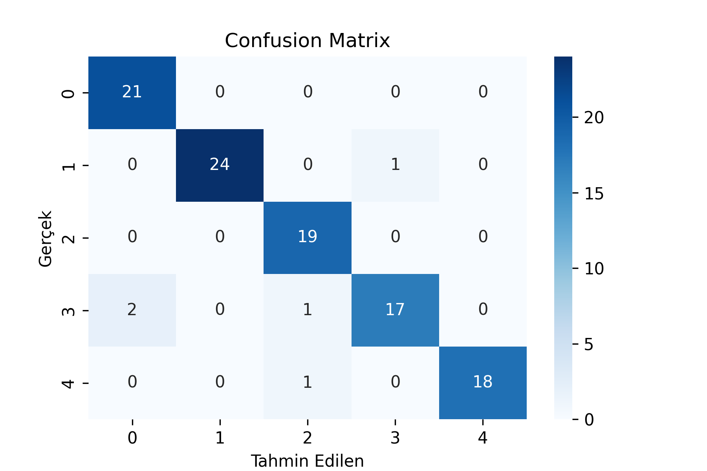
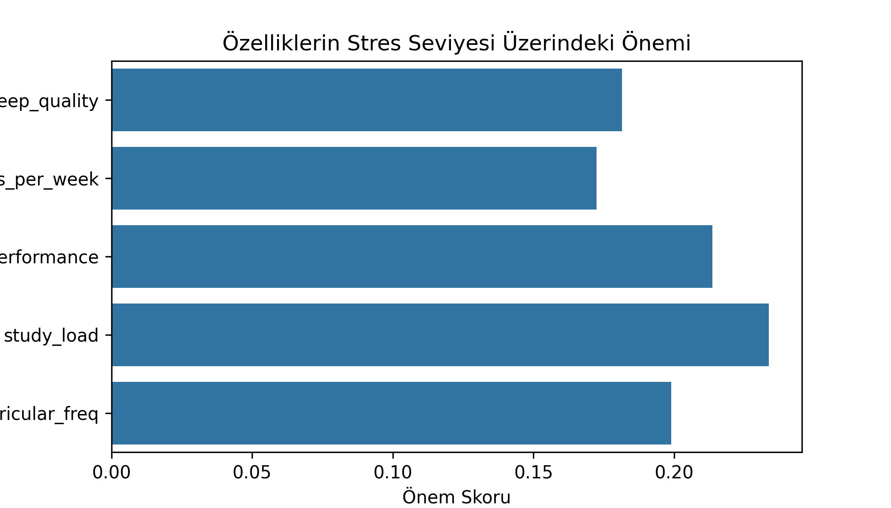

# Student Stress Level Prediction (Mini Kaggle Project)

Bu proje, [Kaggle – Student Stress Levels Dataset](https://www.kaggle.com/datasets/grandmaster07/student-stress-levels-dataset) verisini kullanarak öğrencilerin stres seviyelerini analiz eder ve **Random Forest Classifier** modeliyle tahmin etmeyi amaçlar.

---

## Özet

- **Amaç:** Uyku kalitesi, baş ağrısı sıklığı, ders yükü, akademik performans ve kulüp/etkinlik sıklığı gibi faktörlerden öğrencinin **stres seviyesini (1–5)** tahmin etmek  
- **Veri seti:** 520 gözlem, 6 sütun  
- **Hedef değişken:** `stress_level` (1–5 arası kategorik)  
- **Model:** `RandomForestClassifier (n_estimators=200, random_state=42)`

---

## Keşifsel Veri Analizi (EDA)

- Eksik değer yok.  
- Tüm değişkenler 1–5 aralığında derecelendirme (ordinal).  
- Ortalama stres seviyesi ≈ **2.87**  
- `study_load` (ders yükü), stres seviyesiyle **en güçlü pozitif korelasyona** sahip (r ≈ 0.39).  
- `sleep_quality` ile stres arasında zayıf–orta düzey ilişki gözlendi.

**Örnek görseller:**

<p align="center">
  
</p>

---

## Modelleme

```python
from sklearn.ensemble import RandomForestClassifier

model = RandomForestClassifier(
    n_estimators=200,
    random_state=42
)
model.fit(X_train, y_train)
```

### Değerlendirme

- **Accuracy:** ≈ **0.90**  
- Çok sınıflı (5 sınıf) problemde, komşu sınıflar (örn. 3 ↔ 4) arasında sınırlı karışıklık gözlendi.

Özellik önemleri:

<p align="center">
  
</p>

> En etkili değişken: **study_load**, ardından **sleep_quality** ve **academic_performance**.

---

## Kullanılan Teknolojiler

- Python 3.x  
- pandas, numpy  
- matplotlib, seaborn  
- scikit-learn  
- Jupyter Notebook

---

## Kurulum ve Çalıştırma

```bash
git clone https://github.com/nihalenc/student-stress-analysis.git
cd student-stress-analysis
pip install -r requirements.txt
jupyter notebook
```

Notebook: `Student_Stress_Analysis.ipynb`

---

## Çıkarımlar

- Stres seviyesini en çok **ders yükü** etkiliyor; uyku kalitesi ve akademik performans ikincil etkide.  
- Küçük bir veri setiyle dahi Random Forest, tatmin edici bir doğruluk sağladı.  
- Gelecekte daha büyük/çeşitli veri ve başka modellerle (XGBoost, LightGBM) karşılaştırma yapılabilir.

---

## Kaynaklar

- [Kaggle – Student Stress Levels Dataset](https://www.kaggle.com/datasets/grandmaster07/student-stress-levels-dataset)  
- [scikit-learn Documentation](https://scikit-learn.org/stable/)  
- [seaborn Documentation](https://seaborn.pydata.org/)
